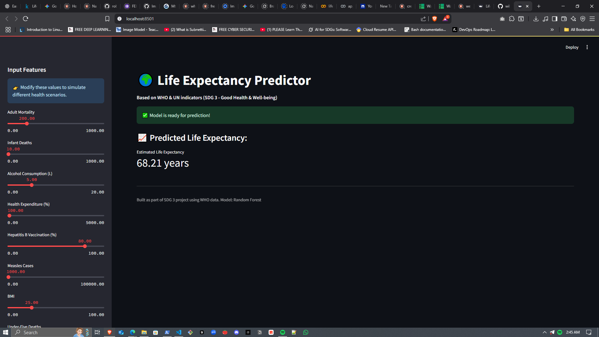

# 🌍 Life Expectancy Predictor - SDG 3

This project is a **machine learning web application** that predicts life expectancy based on health and socio-economic indicators. It supports **UN SDG 3 (Good Health & Well-Being)** by enabling analysis and simulation of public health scenarios.

Developed using **Random Forest**, the model is trained on the [WHO's Life Expectancy Dataset](https://www.kaggle.com/datasets/kumarajarshi/life-expectancy-who) and deployed via **Streamlit**.

## 🔍 Features

- Predicts life expectancy using 18+ features (e.g., alcohol, GDP, vaccinations).
- Interactive sliders to simulate real-world health interventions.
- Real-time predictions using a trained Random Forest model.
- Clean, responsive UI built with Streamlit.

## 🧪 Demo

> **To test locally:**
> http://localhost:8501



---

## 🚀 Installation

> You can run this project on **Jupyter, VS Code**, or any local machine with Python installed.

### ✅ Requirements

- Python 3.7+
- pip
- Streamlit
- scikit-learn
- pandas
- numpy
- joblib

### 📦 Install Dependencies

```bash
git clone https://github.com/YOUR_USERNAME/life-expectancy-predictor.git
cd life-expectancy-predictor
pip install -r requirements.txt
```

## 💻 Usage

1. Run the app

```bash
streamlit run app.py
```

2. Interact with the sidebar  
Adjust the sliders (e.g., infant deaths, BMI, HIV/AIDS %, GDP) to simulate different scenarios.

3. Get Results  
The predicted life expectancy appears instantly with a metric and indicator.

## 📂 Project Structure

```bash
life-expectancy-predictor/
│
├── app.py                    # Streamlit app
├── random_forest_model.pkl   # Trained model
├── data/
│   └── Life Expectancy Data.csv
├── requirements.txt
└── README.md
```

## 🧠 Model Details

Algorithm: Random Forest Regressor

Features: Health expenditure, immunization %, GDP, HIV/AIDS rate, schooling, etc.

Preprocessing: Missing value handling, one-hot encoding (Status), scaling using StandardScaler.

## 🤖 How to Train Your Own Model (Optional)

You can retrain the model using the original dataset:

```python
# train_model.py
import pandas as pd
from sklearn.ensemble import RandomForestRegressor
from sklearn.model_selection import train_test_split
from sklearn.preprocessing import StandardScaler
import joblib

df = pd.read_csv("data/Life Expectancy Data.csv")
df.drop(["Country", "Year"], axis=1, inplace=True)
df.dropna(inplace=True)
df = pd.get_dummies(df, columns=["Status"], drop_first=True)

X = df.drop("Life expectancy ", axis=1)
y = df["Life expectancy "]

scaler = StandardScaler()
X_scaled = scaler.fit_transform(X)

X_train, X_test, y_train, y_test = train_test_split(X_scaled, y, test_size=0.2)

model = RandomForestRegressor()
model.fit(X_train, y_train)

joblib.dump(model, "random_forest_model.pkl")

```


## 🌐 Deployment Options

Option A: Localhost (Recommended)

```bash
streamlit run app.py
```

Option B: Streamlit Community Cloud

- Push your project to GitHub
- Go to streamlit.io/cloud
- Connect your repo and deploy

Option C: Google Colab (Using pyngrok)

In Colab:

```python
!pip install pyngrok streamlit
from pyngrok import ngrok
!streamlit run app.py &

public_url = ngrok.connect(8501)
print(public_url)
```

## 🧩 Stretch Goals (Future Work)

- 📊 Add Explainability with SHAP or LIME
- 🧬 Integrate more features (like climate/environmental data)
- 🌐 Build a mobile-friendly PWA or Android app
- 📈 Deploy to Hugging Face Spaces or Dockerized Cloud VM

## 🤝 Contributing

- Fork the repository
- Create a new branch (git checkout -b feature-xyz)
- Commit your changes (git commit -m 'Add something')
- Push to the branch (git push origin feature-xyz)
- Open a Pull Request

## 🛡 License

This project is licensed under the MIT License. See LICENSE for details.
